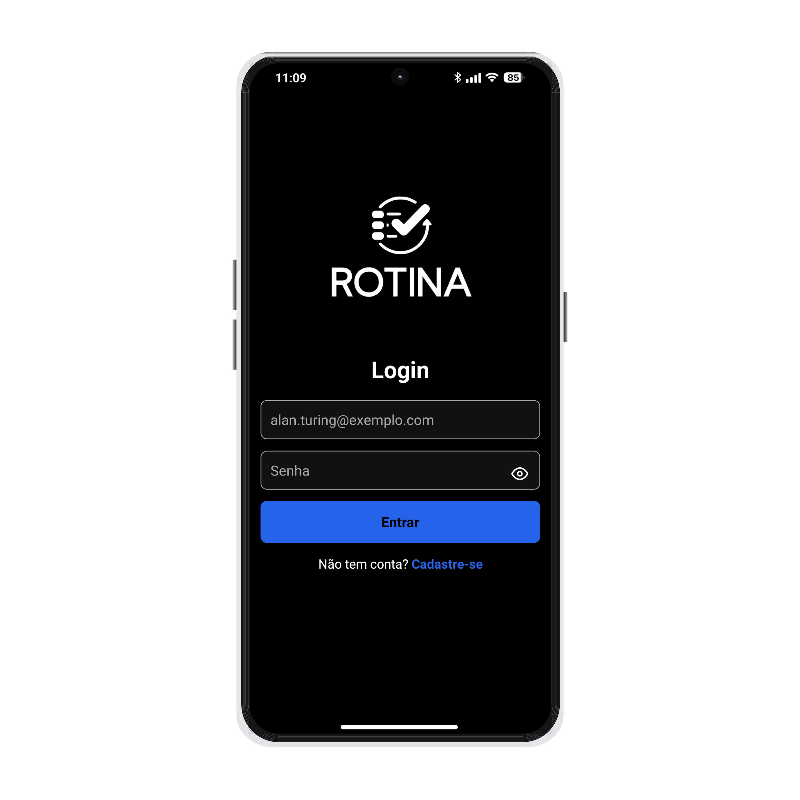
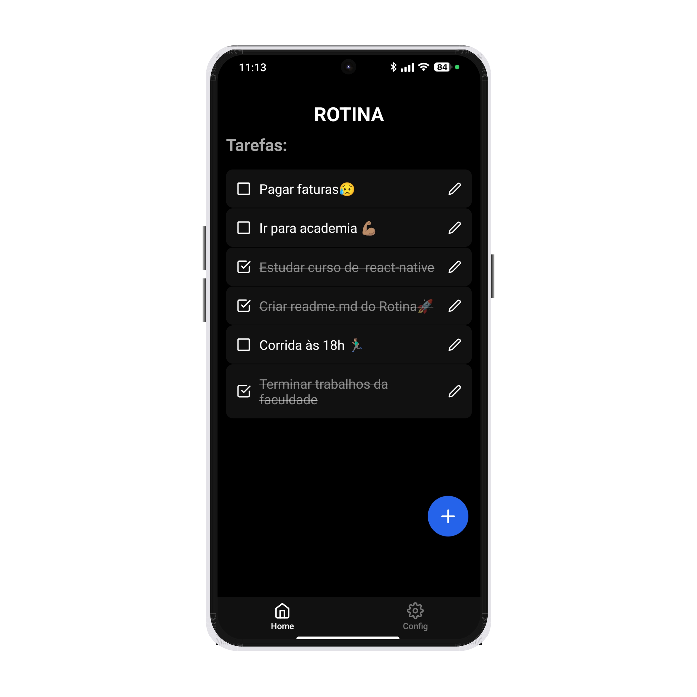
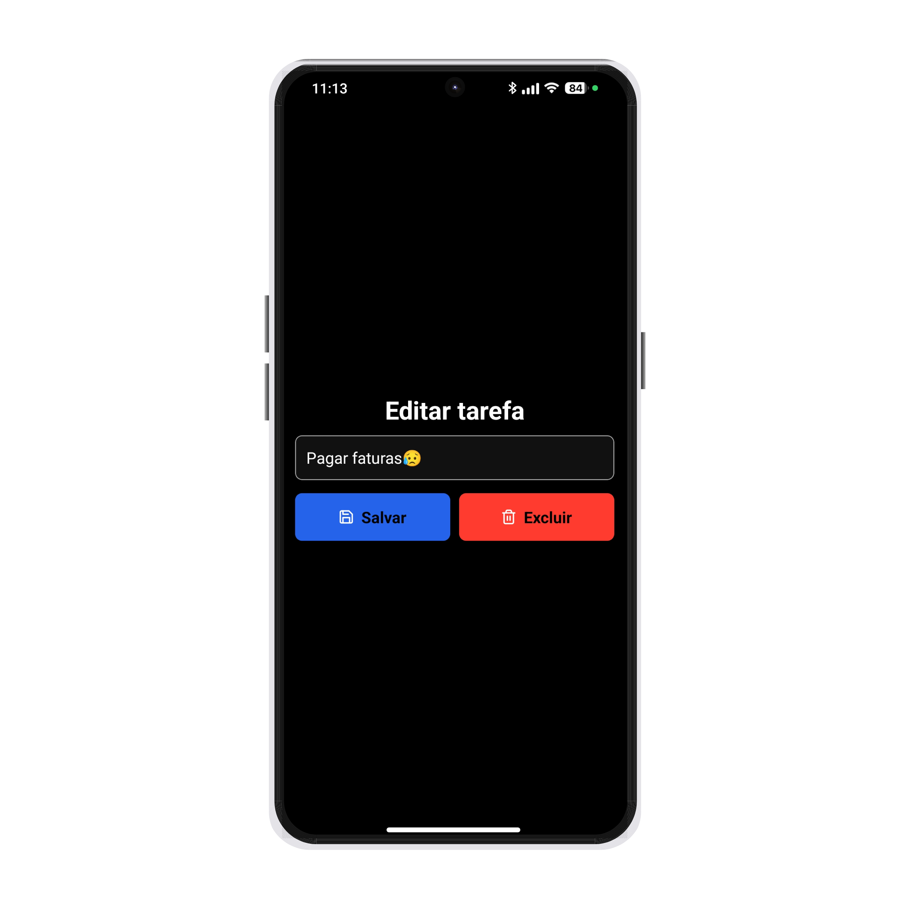
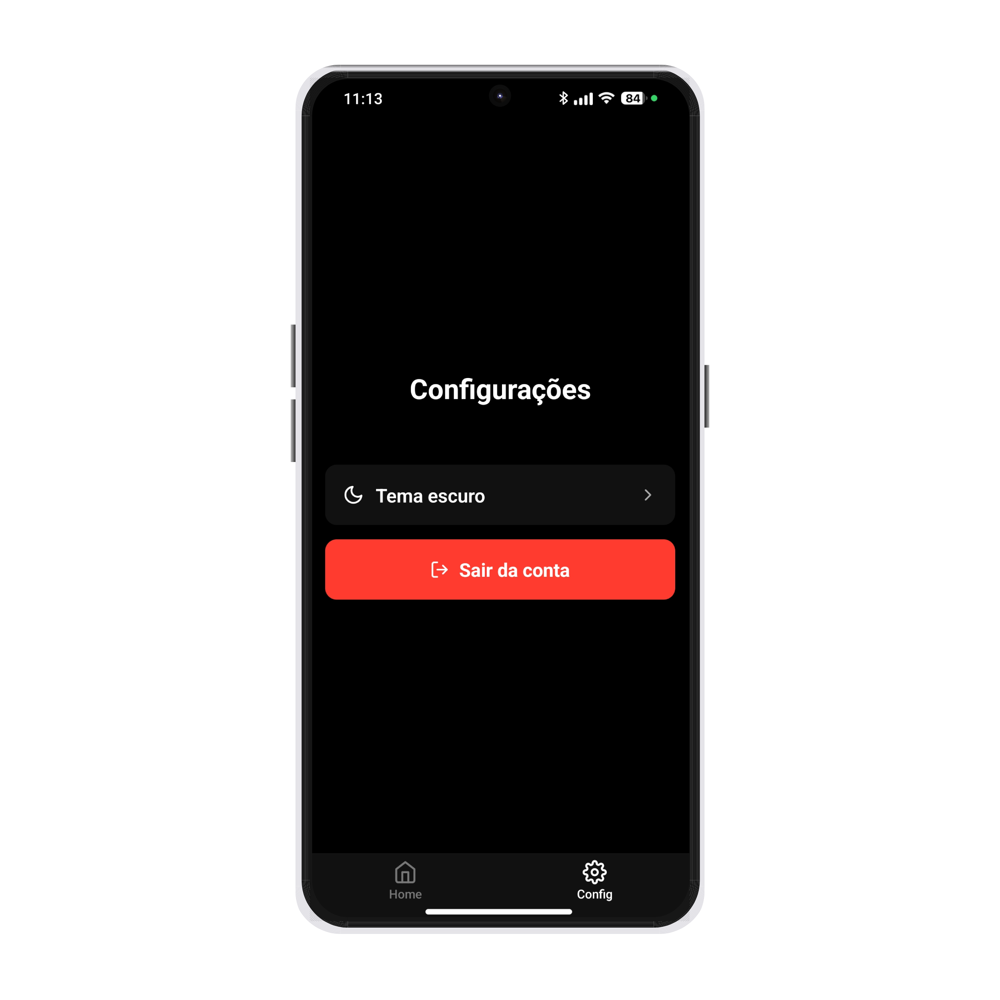

# 📋 Rotina

Aplicativo mobile de gerenciamento de tarefas desenvolvido com React Native, Expo e Supabase.

O objetivo do projeto é permitir que usuários criem, editem, organizem e acompanhem suas tarefas de forma simples e moderna.

---

# 🚀 Tecnologias utilizadas

* React Native
* Expo
* Supabase
* React Navigation
* Context API
* JavaScript

---

# ✨ Funcionalidades

* ✅ Cadastro de usuários
* ✅ Login e autenticação
* ✅ Criação de tarefas
* ✅ Edição de tarefas
* ✅ Exclusão de tarefas
* ✅ Marcação visual de tarefas concluídas
* ✅ Tema claro e escuro
* ✅ Logout
* ✅ Navegação com Tab Navigator
* ✅ Banco de dados


---

# 📱 Screens

* Login
* Cadastro
* Home
* Tasks
* Configurações

---

# 🔐 Backend

O projeto utiliza o Supabase como backend para:

* autenticação
* banco de dados
* gerenciamento de usuários

---

# ⚙️ Como executar o projeto

## 1. Clone o repositório

```bash
git clone https://github.com/vinciussabino/rotina.git
```

---

## 2. Entre na pasta do projeto

```bash
cd rotina
```

---

## 3. Instale as dependências

```bash
npm install
```

---

## 4. Configure o arquivo .env

Crie um arquivo `.env` na raiz do projeto:

```env
EXPO_PUBLIC_SUPABASE_URL=SUA_URL
EXPO_PUBLIC_SUPABASE_KEY=SUA_CHAVE
```

---

## 5. Inicie o projeto

```bash
npx expo start
```

---

# 📸 Preview

## Tela de Login 🔑

<p align="center">
  
</p>

## Tela Inicial 🏠

<p align="center">
  
</p>

## Tela Adicionar Tarefa 📝

<p align="center">
  
</p>

## Tela Configurações ⚙

<p align="center">
  
</p>


---

# 👨‍💻 Autor

Desenvolvido por Vinícius Sabino.